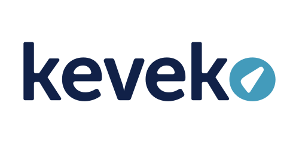

# Keveko Brand Assets

Centralised brand assets for **Keveko Financial Planners** (FSP 43268), a subsidiary of Black Cygnet Group. Served globally via jsDelivr CDN — no install step required.

## About Keveko

Keveko is a modern financial planning brokerage that exists to make quality financial advice accessible to everyday South Africans. The brand helps people reduce anxiety, build financial confidence, and create long-term security by delivering honest, human-centred advice around insurance and investments. It stands for accessibility, clarity, and expertise.

## Documentation

Three guides at the repo root cover different audiences — read whichever applies:

- [`brand-assets-overview.md`](./brand-assets-overview.md) — non-technical overview of what this is and why it exists, for anyone in the business.
- [`brand-maintenance.md`](./brand-maintenance.md) — step-by-step guide for the marketing / brand team on how to update assets (no coding required).
- [`brand-assets-technical-guide.md`](./brand-assets-technical-guide.md) — technical reference for developers and AI engineers, including code examples and ready-to-paste AI prompt blocks.

## Using these assets in an app

Every file in this repo is automatically available on jsDelivr. The URL pattern is:

```
https://cdn.jsdelivr.net/gh/Black-Cygnet-Group/keveko-brand@<tag>/<path-in-repo>
```

### Logo in an HTML page or email

```html

```

### Logo in a React component

```ts
const KEVEKO_LOGO = 'https://cdn.jsdelivr.net/gh/Black-Cygnet-Group/keveko-brand@v0.1.0/logo/primary/keveko-logo-primary-full-colour.svg';

export const Header = () => ;
```

### Colour tokens via CSS variables

```html
<link
  rel="stylesheet"
  href="https://cdn.jsdelivr.net/gh/Black-Cygnet-Group/keveko-brand@v0.1.0/colour/palette.css"
/>
```

Then use `var(--keveko-ocean)`, `var(--keveko-sky)`, etc.

### Colour tokens as JSON (any framework)

```ts
import palette from 'https://cdn.jsdelivr.net/gh/Black-Cygnet-Group/keveko-brand@v0.1.0/colour/palette.json'
  assert { type: 'json' };
```

Or copy the values from [`colour/palette.json`](./colour/palette.json) into your app's theme directly — both are valid.

## Versioning — how to pin

- **Production apps: always pin to a tag** (e.g. `@v0.1.0`). Your app will not break if we update an asset.
- **Development or always-latest: use `@main`** (e.g. `@main/logo/...`). You'll get updates immediately, including breaking ones.
- Never mix the two in the same app.

## Releases

See [CHANGELOG.md](./CHANGELOG.md) for what changed in each version.

- **Major** (e.g. v2.0.0): an asset was removed, renamed, or changed in a way that breaks existing apps.
- **Minor** (e.g. v1.1.0): a new asset was added.
- **Patch** (e.g. v1.0.1): an asset was fixed (e.g. a cleaner SVG export) but looks identical.

## Brand identity at a glance

### Colour palette

The canonical palette. See [`colour/palette.json`](./colour/palette.json) for the full definition with RGB, CMYK, and usage rules.

<table>
  <thead>
    <tr><th>&nbsp;</th><th>Name</th><th>Hex</th><th>Usage</th></tr>
  </thead>
  <tbody>
    <tr>
      <td bgcolor="#001f49" width="80">&nbsp;</td>
      <td><strong>Ocean</strong></td>
      <td><code>#001f49</code></td>
      <td>Primary — body text, primary dark. Never use plain black for body.</td>
    </tr>
    <tr>
      <td bgcolor="#439bbb" width="80">&nbsp;</td>
      <td><strong>Sky</strong></td>
      <td><code>#439bbb</code></td>
      <td>Primary background. Pairs with Ocean or White for text.</td>
    </tr>
    <tr>
      <td bgcolor="#f6e2e0" width="80">&nbsp;</td>
      <td><strong>Misty Rose</strong></td>
      <td><code>#f6e2e0</code></td>
      <td>Secondary background. Body text only when on an Ocean background.</td>
    </tr>
    <tr>
      <td bgcolor="#fe3725" width="80">&nbsp;</td>
      <td><strong>Candy</strong></td>
      <td><code>#fe3725</code></td>
      <td>Secondary accent / error. Never as a background or body text.</td>
    </tr>
    <tr>
      <td bgcolor="#b71d21" width="80">&nbsp;</td>
      <td><strong>Maroon</strong></td>
      <td><code>#b71d21</code></td>
      <td>Secondary accent. Never as a background or body text.</td>
    </tr>
    <tr>
      <td bgcolor="#ffffff" width="80">&nbsp;</td>
      <td><strong>White</strong></td>
      <td><code>#ffffff</code></td>
      <td>Primary background. Reversed text on Ocean backgrounds.</td>
    </tr>
  </tbody>
</table>

**Usage ratio across collateral:** Ocean 50% / Sky 30% / Misty Rose 10% / Candy 5% / Maroon 5%.

### Logo

The primary logo is the Keveko word mark. The letter "o" doubles as a symbol — a subtle nod to clock, speedometer, and compass.



**Available variants (5 colour treatments, each in SVG and PNG, for both primary and byline lockups):**

- `full-colour` — navy word mark with sky "o"
- `reversed` — white word mark with sky "o", for dark backgrounds
- `mono-black`, `mono-navy`, `mono-white` — single-tone

The byline lockup pairs the word mark with "Your Financial Planner" and is used when the brand is being introduced. See [`logo/secondary/`](./logo/secondary/).

The **mark** (the standalone "o" symbol) is available as PNG in 7 tints: black, white, navy, sky, candy, misty-rose, and maroon. SVG is not yet available — see [`OPEN-QUESTIONS.md`](./OPEN-QUESTIONS.md) item 2. See [`logo/mark/`](./logo/mark/).

**Usage rules:**

- Minimum size: **150 px** digital, **10 mm** print.
- Clear space: maintain at least half the icon's diameter around the logo on all sides.
- Approved backgrounds: white (primary), Sky with Ocean or White text, Ocean with White or Misty Rose text. Use `reversed` on dark backgrounds.
- Do not: stretch, re-colour, apply effects, or place on busy photographic backgrounds.

### Typography

| Family | Role | Weights | Source |
|---|---|---|---|
| Museo Sans | Primary — all brand collateral | 300, 400, 500, 700, 900 | Adobe Fonts / MyFonts (commercial) |
| Century Gothic | Web fallback | 400, 700 | System / widely licensed |
| Feeling Passionate | Accent (sparing use) | 400 | Source to be confirmed — see [`OPEN-QUESTIONS.md`](./OPEN-QUESTIONS.md) |

Body text is always Ocean `#001f49`, never plain black. See [`typography/fonts.md`](./typography/fonts.md) for sourcing details and `@font-face` snippets.

### Full brand guidelines

The canonical brand guide — logo usage, photography treatment, patterns, tone of voice — is in [`guidelines/keveko-brand-guide.pdf`](./guidelines/keveko-brand-guide.pdf).

## Related repositories

- [Black Cygnet Life brand assets](https://github.com/Black-Cygnet-Group/black-cygnet-life-brand)

## Open questions

Some brand items are still awaiting input from the brand and marketing teams — see [OPEN-QUESTIONS.md](./OPEN-QUESTIONS.md).

## Maintenance

See [HANDOVER.md](./HANDOVER.md) for maintainer documentation.

## Requesting changes

Open an issue in this repo, or contact the maintainers listed in [HANDOVER.md](./HANDOVER.md).
